# Autodesk.Icon.Example

Image icon example based on the [Autodesk Icon Guidelines](#Autodesk-Icon-Guidelines) for light and dark theme.

## Revit Example

### Light
[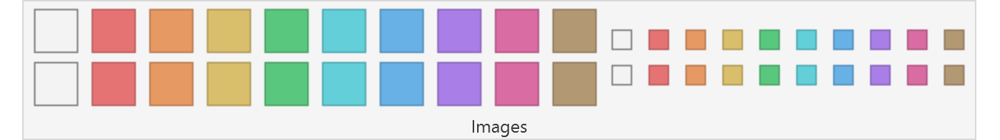](../..)
[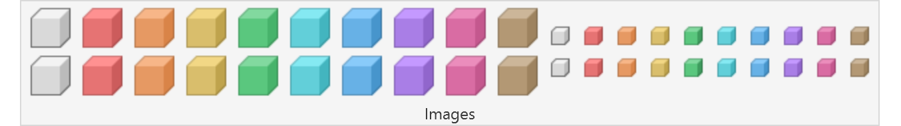](../..)

### Dark
[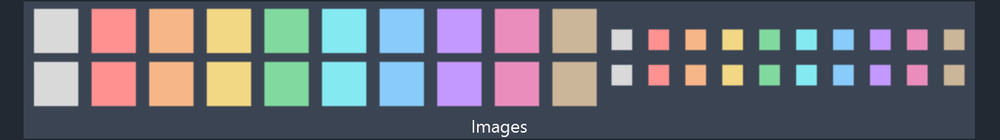](../..)
[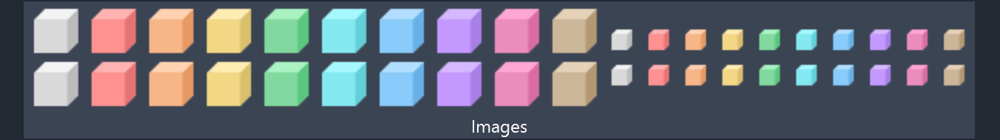](../..)

## Images

Each image icon has sizes 16 and 32 in `.png`. The `.ico` contains both sizes.

### Light
| Grey | Red | Yellow | Green | Cyan | Blue | Purple | Pink | Brown |
| - | - | - | - | - | - | - | - | - |
|||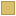||||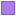||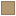|
||||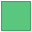|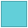|||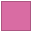||
|||||||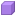|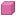|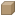|
||||||||||

### Dark
| Grey | Red | Yellow | Green | Cyan | Blue | Purple | Pink | Brown |
| - | - | - | - | - | - | - | - | - |
|||||||||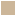|
||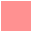|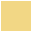|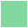|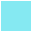|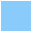||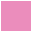||
||||||||||
||||||||||

## Autodesk Icon Guidelines

The Autodesk Icon Guidelines is available in the [The Building Coder](https://thebuildingcoder.typepad.com/blog/2023/01/dark-theme-possibility-looming.html#2.6).

* [Autodesk Icon Guidelines PDF](https://thebuildingcoder.typepad.com/icon/2023-01-20_icon_design_guidelines.pdf)
* [Zip file including badges and PNG instructiuons](https://thebuildingcoder.typepad.com/icon/2023-01-20_icon_design_guideline.zip)

## Release

* [Latest release](../../releases/latest)

## License

This project is [licensed](LICENSE) under the [MIT Licence](https://en.wikipedia.org/wiki/MIT_License).

---

Do you like this project? Please [star this project on GitHub](../../stargazers)!
